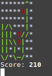

# Snake Game
line parameters:

    -l n  -  set level number  
    -c n  -  count of food on map  
    -p n  -  waiting time for direction selection (example: -p 0.4)  
    -n n  -  width and height of the field
    -h    -  print this help  

